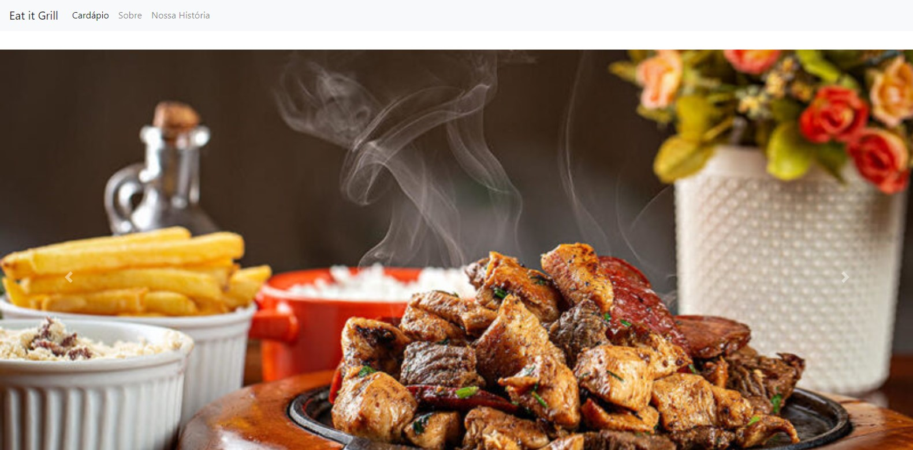
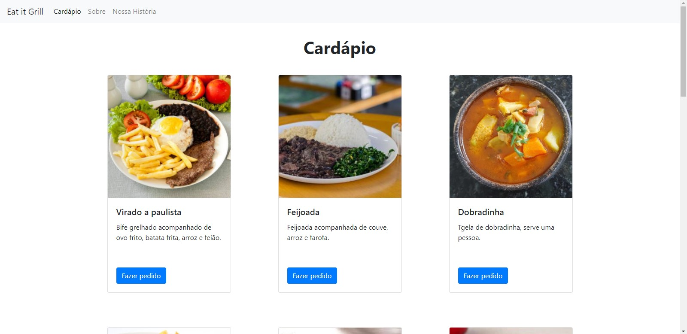

<h1 align="center">
  Eat it grill
</h1>

 

  

 

## **Sobre o projeto**

#### Site desenvolvido para a disciplina de Desenvolvimento Web II.

Site de um restaurante fictício, desenvolvido para aprimorar os conhecimentos do framework Bootstrap.

 

## **Páginas**

- Home
- Cardápio
- Sobre
- Nossa história

 

## **Demonstração**

A página de cardápio traz uma lista com todos os pratos do restaurante, mostrados em cards.

 

  

 

## **Tecnologias utilizadas**

